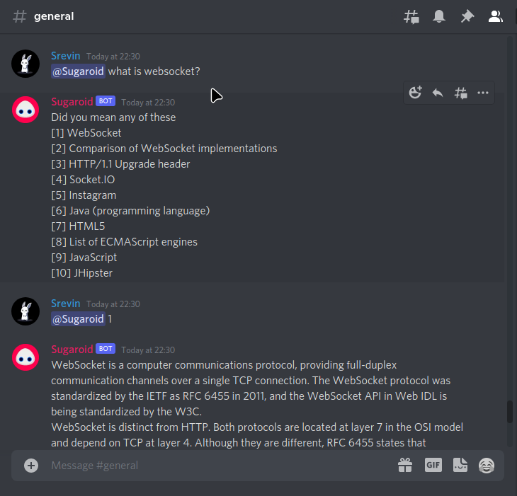

sg-discord
==========

A thin discord wrapper built on top of Sugaroid Websocket implementation.



Build 
-----
```bash
go build .
```

Run
----
```bash
export DISCORD_BOT_TOKEN="supersecrettoken" 
export SG_DS_WS_ENDPOINT="localhost:3000"
./sg-discord
```

License
-------
[This project](https://github.com/sugaroidbot/sg-discord) is 
licensed under the [MIT License](./LICENSE)
